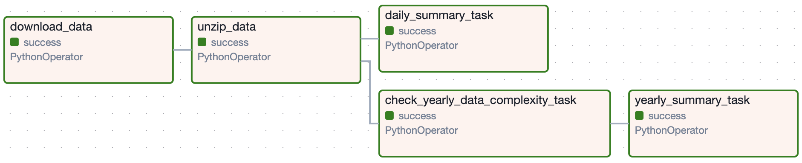

## Data Engineering Practice
### Data source: [Backblaze](https://www.backblaze.com/cloud-storage/resources/hard-drive-test-data)
* It provides hard drive data and stats
* The data range is 2019 Q1 - 2023 Q3
* Hard drive brands - data tract from column "model"
  * Crucial - prefix CT
  * Dell BOSS - prefix DELLBOSS
  * HGST - prefix HGST
  * Seagate - prefix Seagate, ST
  * Toshiba - prefix TOSHIBA
  * Western Digital - prefix WDC
  * Others - if non-above matches
### Practice 1
Daily summary (by date)
* Drive count
* Drive failures
### Practice 2
Yearly summary (by year)
* Drive failures count by brand
### Requirement
* End-to-end delivery
  * Download the batch data from data source
  * Processing it to meet the targets
  * Show the results in files or UI with tables & charts (BI tools may help) (UI is optional)
### Built with
* Python
* [Spark](https://spark.apache.org/)
* [Airflow](https://airflow.apache.org/)
### Airflow DAG graph

### Reference
export AIRFLOW_HOME to project root before run `airflow scheduler` and `airflow webserver --port 8080`

[Setting up Apache-Airflow in macOS](https://medium.com/accredian/setting-up-apache-airflow-in-macos-57ab9e8edb8a)

